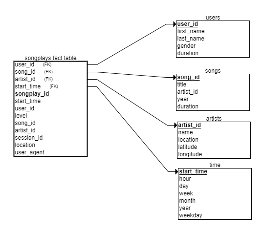

# Project 3:

## Purpose of the database

The main purpose of the database is to analize what and when do people listen to the music. Irrespective of how many people do that, the data allow use to identify music patterns about gendre or published year. According to that, so many recommendations can be done. Were I to be the owner of Sparkify, I would deeply investigate that database

## Process

The process have 3 steps:

1. Create the Redshift cluster with the suitable roles and permissions and the database
2. Copy the data from S3 Bucket to the staging tables
3. Insert data into the final tables from those staging tables

## Database schema:

On one hand we have the staging tables, in which the schema is inherit from the json files

1. **staging_songs**: imported from s3://udacity-dend/song_data
2. **staging_events**: imported from s3://udacity-dend/log_data using the schema in s3://udacity-dend/log_json_path.json

There are 5 tables organized in a star-schema:

1. **songplays**: songplay_id, start_time, user_id, level, song_id, artist_id, session_id, location, user_agent
2. **users**: user_id, first_name, last_name, gender, level
3. **songs**: song_id, title, artist_id, year, duration
4. **artists**: artist_id, name, location, latitude, longitude
5. **time**: start_time, hour, day, week, month, year, weekday

## Example of raw rows:

These are two examples of the rows of the raw files:

### Songs file

`
{
  "num_songs": 1,
  "artist_id": "ARD7TVE1187B99BFB1",
  "artist_latitude": null,
  "artist_longitude": null,
  "artist_location": "California - LA",
  "artist_name": "Casual",
  "song_id": "SOMZWCG12A8C13C480",
  "title": "I Didn't Mean To",
  "duration": 218.93179,
  "year": 0
}`

### Logs file

`{
  "artist": null,
  "auth": "Logged In",
  "firstName": "Walter",
  "gender": "M",
  "itemInSession": 0,
  "lastName": "Frye",
  "length": null,
  "level": "free",
  "location": "San Francisco-Oakland-Hayward, CA",
  "method": "GET",
  "page": "Home",
  "registration": 1540919166796,
  "sessionId": 38,
  "song": null,
  "status": 200,
  "ts": 1541105830796,
  "userAgent": "\"Mozilla/5.0 (Macintosh; Intel Mac OS X 10_9_4) AppleWebKit/537.36 (KHTML, like Gecko) Chrome/36.0.1985.143 Safari/537.36\"",
  "userId": "39"
}`

## How to launch the scripts?

We assume that Step 1 has been done in a previous procedure.

For creating the tables we should execute `python create_tables.py`

For loading the data and inserting it from the into the database we should execute `python etl.py`

## Files in the repository

* **create_tables.py**: python script with the process of creating of the tables
* **etl.py**: python script with the process of inserting data from the data path into the database
* **sql_queries**: text file in which all the queries executed in python scripts are located
* **README.md**: basic information about the project 